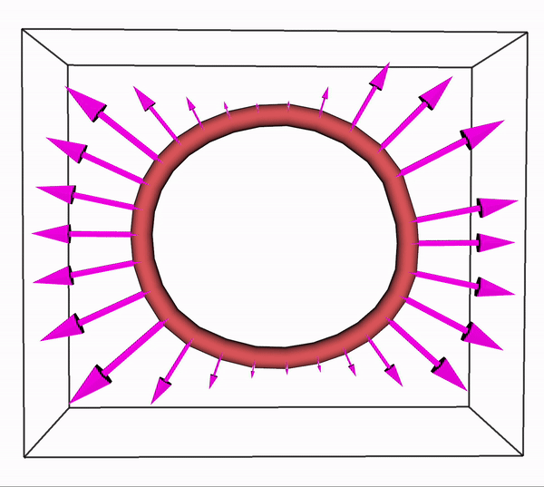
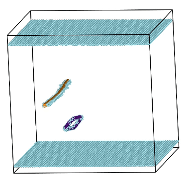

<table border="1">
  <tr>
    <td>
        <figure>
            
            <figcaption>Simulated crystallization of austenitic stainless steel with LAMMPS</figcaption>
        </figure>
    </td>
    <td>
        <figure>
            
            <figcaption>Vacancy hopping in FeNiCrCoMn with LAMMPS</figcaption>
        </figure>
    </td>
  </tr>
  <tr>
    <td>
        <figure>
            
            <figcaption>Continuum Dislocation Dynamics simulation with Machine Learning Mobility for Fe</figcaption>
        </figure>
    </td>
    <td>
        <figure>
            
            <figcaption>Edge dislocation- SIA interaction in tungsten at 100 MPa and 500 K</figcaption>
        </figure>
    </td>
  </tr>
</table>
