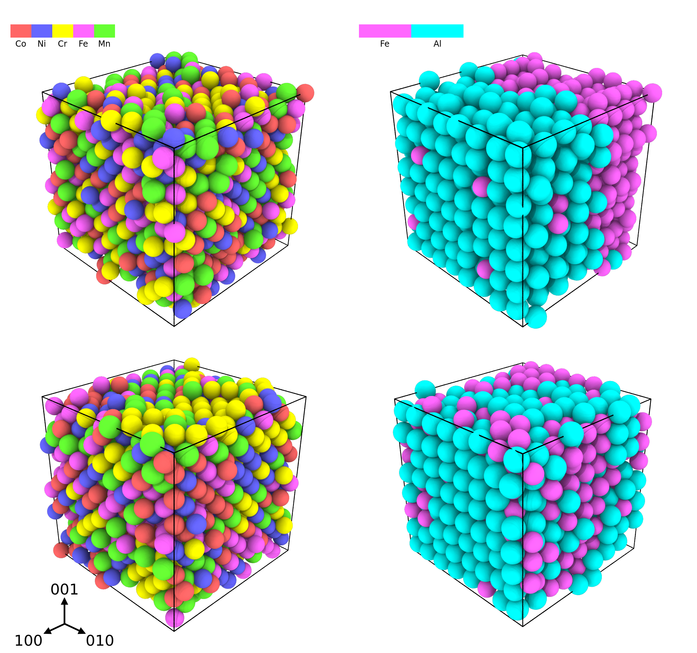

# Highlighted Works

---

     

          
     

     

          
Dislocations control plasticity in metals, and understanding how they move is crucial for predicting material behavior. In tungsten, we found that as temperature rises, dislocations shift from non-Arrhenius to Arrhenius behavior when overcoming elastic barriers. Analyzing this transition requires considering activation entropy, which we calculated using Schoeck's method and compared with results from the Projected Average Force Integrator (PAFI).

     

---

     

          
     

     

          
 Dislocation mobility, crucial for understanding plastic deformation in materials, is traditionally derived from complex atomic simulations. We propose a new approach using Physics-informed Graph Neural Networks (PI-GNN) to learn mobility laws from large-scale molecular dynamics simulations more accurately, especially for complex materials like body-centered cubic crystals (BCC) metals and alloys. This method improves upon existing phenomenological models by incorporating uncertainty quantification and active learning.

     

---

     

          
     

     

          
We present a general Langmuir-like model for impurity concentration in a solid solution and apply this model to generate expressions for concentrations of vacancies and small interstitial atoms. We then calculate the vacancy concentration as a function of temperature in the equiatomic CoNiCrFeMn and FeAl alloys with modified embedded-atom-method potentials for various chemical orderings, showing there is no clear correlation between vacancy thermodynamics and chemical ordering in the CoNiCrFeMn alloy but clear systematic patterns for FeAl.

     

---

     

          
     

     

          
Short-range order (SRO) in multicomponent concentrated alloys affects their mechanical response. Hence, is paramount to understand how composition modifies the chemical ordering in the system to design materials with optimal properties. We present here a methodology to predict the SRO and thermodynamic properties in chemically complex systems and apply it to the WTaCrVHf quinary alloy. We observe that the addition of Hf significantly modifies the SRO, mainly at intermediate to low temperatures, matching experimental observations.

     

---