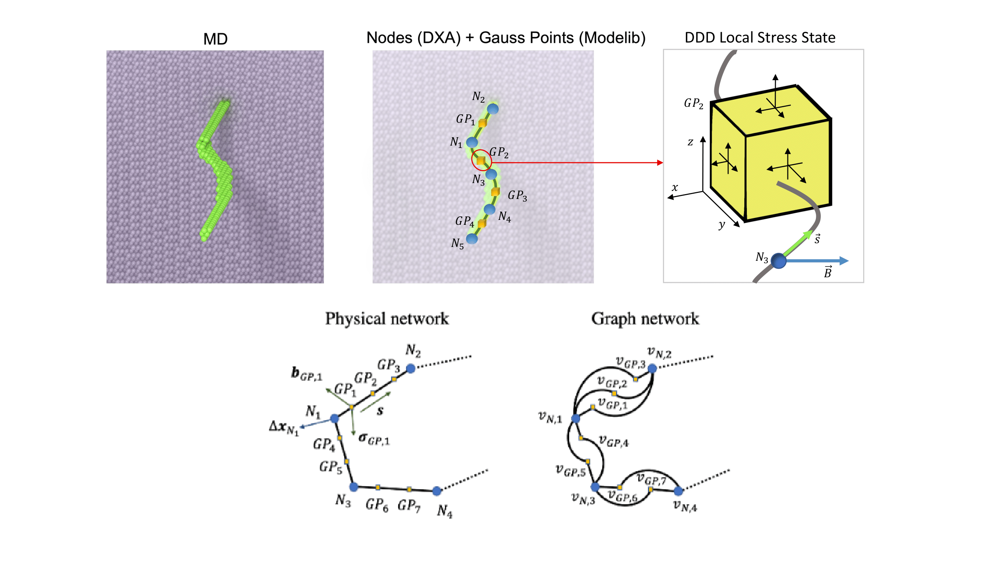

# Our Work

## Find out what exciting work is happening within the research group!

Our team works collaboratively with international researchers to develop new methods and tools for materials analysis. Below you can find a summary of some of the projects that we're working on, with respective links to any associated information.

---
### Materials Analysis of High Entropy Alloys (HEA)

     

          
     

     

          
This is your Project description. Provide a brief summary to help visitors understand the context and background of your work. Click on "Edit Text" or double click on the text box to start.

     

---
### Developing Multi-Scale Models via Molecular Dynamics (MD), Dislocation Dynamics (DD), and Machine Learning (ML)

     

          
Schematic of a generic MD dislocation line being discretized via the DXA algorithm, further discretized to populate Gauss-Quadrature points for DDD stress analysis, and reformatted to be compatible with a physically informed graph neural network (PI-GNN)

     
 
     

          
     

---
